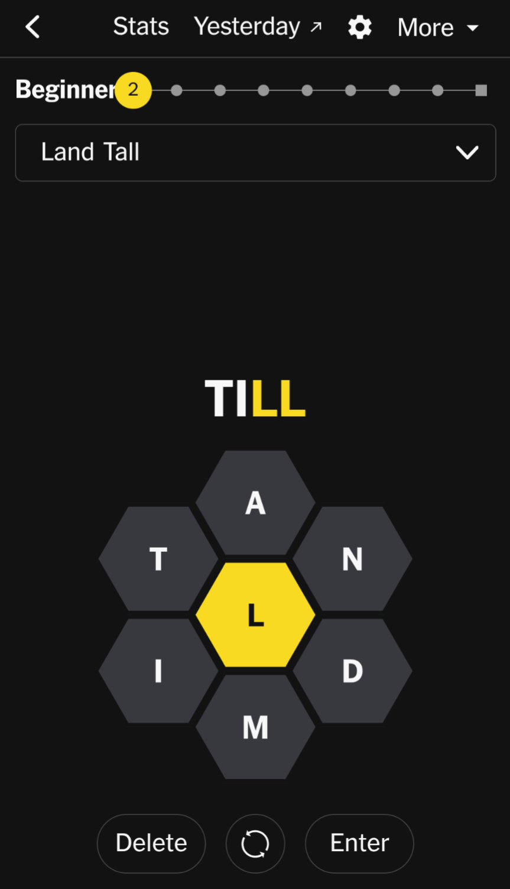
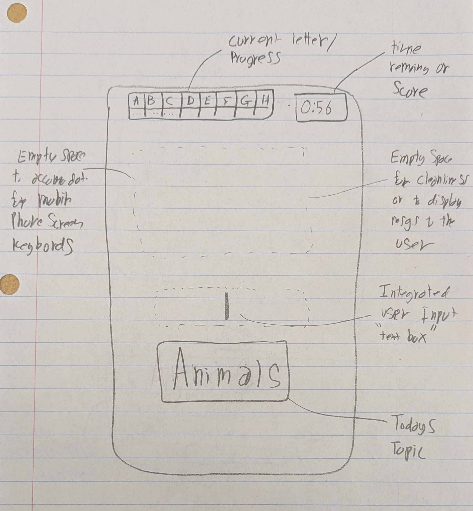
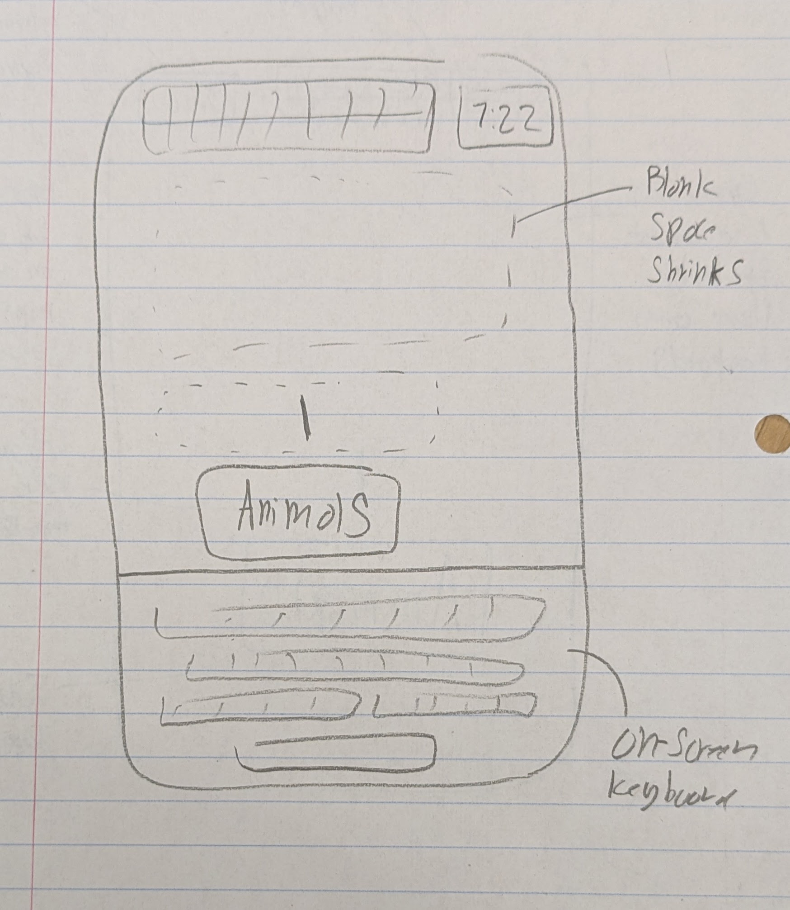

# Alphabet Game
[My Website](https://startup.webdev260.click)  
[Simon](https://simon.webdev260.click)  
[My Notes](notes.md)  

### Startup Description
Mini word games like crosswords, wordsearches, have seen a recent growth in popularity as newspaper companies like the New York Times and 
the The Washington Post. Even LinkedIn has integrated some word games into their app. crosswords and other words games have been around 
for a long time, but their recent emergence is likely due to newspaper companies transitioning the games from their traditional printed format
to websites and mobile apps. In my personal opinion the NYT has done this the best, presenting word games in an clean, simple app available on IOS and Android. New games are posted every day which keeps people coming back every day for more. My wife plays these games religiously every night.  

One game that I personally would like to see implemented on the NYT app is the "alphabet game", though it may go by other names. Basically you are given a topic, and must think of a word that fits into that topic for every letter in the alphabet. Like the NYT games it is simple, fun, and 
mentally stimulating in a positive way. Since this game isn't provided anywhere I'm going to undertake the task of developing it myself. 
Since the most user friendly way to present the game is in my opinion a mobile app, the web application I design for the game will be targeted 
towards mobile phone screen sizes so that users can have a similarly clean and hassle free experience.

## 🚀 Specification Deliverable

For this deliverable I did the following. I checked the box `[x]` and added a description for things I completed.
- [x] Proper use of Markdown
- [x] A concise and compelling elevator pitch
- [X] Description of key features
- [X] Description of how you will use each technology
- [X] One or more rough sketches of your application. Images must be embedded in this file using Markdown image references.

### Elevator pitch

Have you ever played the New York Times word games? Word games like this are growing in popularity and big companies like the NYT, Washington Post and even LinkedIn have jumped on the word game train. The word games are fun, mentally stimulating, and short, which makes them perfect for a 2 minute break from work, waiting at the bus stop, or playing right before bed. With the busy lives people lead nowadays a short game like this fits perfectly into everyones schedule. One game that is a personal favorite that I and others would like to see imlemented is the alphabet game. In the alphabet game you are given a topic and must find one word that starts with each letter of the alphabet that fits in the given topic. The game has lots of potential in the way it is presented. For example it could be played as a time race against another opponent, as a team game where two or more members alternate thinking of words for the different letters of the alphabet, or it could be points-based where for a given set of time, more points are given for more complicated words. If the game is presented as a web application in a mobile-phone friendly format, it could become extremely popular across the nation and the world.

### Design

shown above is the format of the NYT game. Desirable traits to emulate are the clean and simple interface, the lack of ads (although ads are displayed between games) and the ability to switch between light and dark mode  

below on the left is a sketch of the main page layout - on the right is what it will look like with an on-screen keyboard (for mobile phones)  

### Key features

- Users log into account to keep track of scores, history, and to compete with other players
- Users play the "alphabet game" by listing words that start with each letter of the alphabet that have to do with that days topic
- There is a new topic every day, and the list of words is either extensive or open to interpretation by a AI model of choice
    - I don't want to have to manually create lists of words under a given topic. at least not at this phase in the applications development
- Users can compete against eachother to finish the game the fastest

### Technologies

I am going to use the required technologies in the following ways.

- **HTML** - main structure of all webpages will use HTML
- **CSS** - creating the clean, modern look from NYT games will be done using CSS
- **React** - going from login page to main gameplay to leaderboard will be done using React routing
- **Service** - I may implement multiple local services for various tasks. 
                as for the third party service I'll probably use [one of the following](notes.md#web-api-for-word-generationchecking) to generate lists of words for a given topic.

                 
- **DB/Login** - ability for users to log into their account so they can view their high scores and such
- **WebSocket** - play against your friends in realtime. two "current letter progress" blocks will be displayed at the top of the screen. one for you and one for a friend you're playing against

## 🚀 AWS deliverable

For this deliverable I did the following. I checked the box `[x]` and added a description for things I completed.

- [X] **Server deployed and accessible with custom domain name** - [My server link](https://startup.webdev260.click).

## 🚀 HTML deliverable

For this deliverable I did the following. I checked the box `[x]` and added a description for things I completed.

- [X] **HTML pages** - Added 7 HTML pages 
- [X] **Proper HTML element usage** - used all the required html elements, and more!
- [X] **Links** - header includes links to other pages. friends page includes a link to add friend page
- [X] **Text** - text is minimal, but there is quite a bit of text in about.html
- [X] **3rd party API placeholder** - the 'Todays Topic' field will be populated using the 3rd party API
- [X] **Images** - a gear icon is used next to the username in the header to indicate that clicking on the username (or gear) will take you to settings.
- [X] **Login placeholder** - index.html is the login page
- [X] **DB data placeholder** - friends.html and leaderboard.html will both access the database
- [X] **WebSocket placeholder** - during gameplay, the 'opponent' alphabet will appear and be populated using the websocket. friends.html will also use the websocket for inviting friends to play against you

## 🚀 CSS deliverable

For this deliverable I added styling to all the pages.  
I chose and stuck with a mustard color theme and rounded button design.  
note that on the gameplay page, usually only 1 progress alphabet will show up, unless you're playing live against a friend.
the disappearing of the opponent "hippocarcass123" progress alphabet will be implemented in javascript later.

- [x] **Header, footer, and main content body** - sticky header and footer, main content fills page. nice color scheme
- [x] **Navigation elements** - navbar styled horizontally
- [x] **Responsive to window resizing** - designed for mobile phone but works on desktop too
- [x] **Application elements** - styled all pages in preperation for integration of all required elements
- [x] **Application text content** - text is styled appropriately
- [x] **Application images** - application does not make extensive use of images, but there are images for the favicon and user settings icon

## 🚀 React part 1: Routing deliverable

fully transitioned over to react and vite. organized just like simon. also made some improvements to the css styles and organization due to overflowing style issues.

- [x] **Bundled using Vite** - bundled is using vite
- [x] **Components** - each page is a component in the now SPA
- [x] **Router** - routing is setup in header, also on friends page and about page uses the `useNavite()` method from react

## 🚀 React part 2: Reactivity

added reactivity to all components of the app including: 
- [x] ability to login
    -[x] ability to see account information in settings page
- [x] placeholder for profanity filter
    - [x] placeholder reactivity to 'permanently block' users who use profanity
- [x] ability to play the game
- [x] placeholder for suggestion "chatroom"

### Major Changes:
I think I got a little carried away at the beginning of the semester
and didn't realize how complicated it would be to implement all the
stuff I wanted to implement. So I've made a few major changes but have
also included explanation of how I'll still meet the project requirements

> [!NOTE]
> DROPPED FEATURE - I ditched the scores page. it's just one extra thing to implement
> and I'll already be using websockets and the database to keep track of
> friends

> [!NOTE]
> DROPPED FEATURE - I also ditched the friends page, add friends page, and all the friends stuff. 
> Again it's just another thing to implement that I don't have time for and I 
> can meet the project requirements
> in a different way

> [!NOTE]
> FEATURE UPDATE - you can play as many topics as you want each day (as per request by my wife) 
> every time you finish a game you'll be prompted to start a new game and a random topic will be 
> generated.

> [!NOTE]
> TECHNOLOGY CHANGE - I found out that you have to pay to use ChatGPT API and I don't want to deal with that so instead 
> of asking chat if a given word is in a given topic every single time the user submits a word I'm just going to use static 
> list of words by topic like the JSON file I have in `data/topicList.json` this will be more efficient, easier to implement,
> cheaper, and since I'm not doing friends in the database anymore I'll still be fulfilling the database requirement by storing
> all of the topicLists in the database. apparently mongoDB is very JSON friendly so it should be an easy transition.

> [!NOTE]
> TECHNOLOGY CHANGE - since I'm not doing the friends functionality anymore I obviously can't use web socket to have two players 
> face off against eachother in real time... so instead I'm just going to have a "suggestions" page where there's basically a live chat 
> where anyone can make a suggestions for a topic. this will serve two purposes 1. allow players to "vote" on topics they want to see
> in the future and 2. allow me to see what topics people want without having to setup a fancy admin login or something.

> [!NOTE]
> TECHNOLOGY CHANGE - instead of using chatGPT as my 3rd party service I'm going to use a profanity filter to make sure no
> one gets too frisky in the suggestions chat - it might be fun to even permanently block users from the game like in 
> club penguin haha

#### old technology representation (doing away with)
database: friends
websocket: play with friend
service: chatGPT

#### new technology representation (going forward with)
database: word lists for each topic
websocket: topic suggestions
service:  profanity filter

### Requirements
- [ ] **All functionality implemented or mocked out** - I did not complete this part of the deliverable.
- [ ] **Hooks** - I did not complete this part of the deliverable.

## 🚀 Service deliverable

For this deliverable I did the following. I checked the box `[x]` and added a description for things I completed.

- [ ] **Node.js/Express HTTP service** - I did not complete this part of the deliverable.
- [ ] **Static middleware for frontend** - I did not complete this part of the deliverable.
- [ ] **Calls to third party endpoints** - I did not complete this part of the deliverable.
- [ ] **Backend service endpoints** - I did not complete this part of the deliverable.
- [ ] **Frontend calls service endpoints** - I did not complete this part of the deliverable.

## 🚀 DB/Login deliverable

For this deliverable I did the following. I checked the box `[x]` and added a description for things I completed.

- [ ] **User registration** - I did not complete this part of the deliverable.
- [ ] **User login and logout** - I did not complete this part of the deliverable.
- [ ] **Stores data in MongoDB** - I did not complete this part of the deliverable.
- [ ] **Stores credentials in MongoDB** - I did not complete this part of the deliverable.
- [ ] **Restricts functionality based on authentication** - I did not complete this part of the deliverable.

## 🚀 WebSocket deliverable

For this deliverable I did the following. I checked the box `[x]` and added a description for things I completed.

- [ ] **Backend listens for WebSocket connection** - I did not complete this part of the deliverable.
- [ ] **Frontend makes WebSocket connection** - I did not complete this part of the deliverable.
- [ ] **Data sent over WebSocket connection** - I did not complete this part of the deliverable.
- [ ] **WebSocket data displayed** - I did not complete this part of the deliverable.
- [ ] **Application is fully functional** - I did not complete this part of the deliverable.
